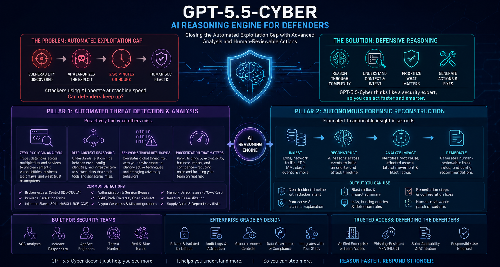
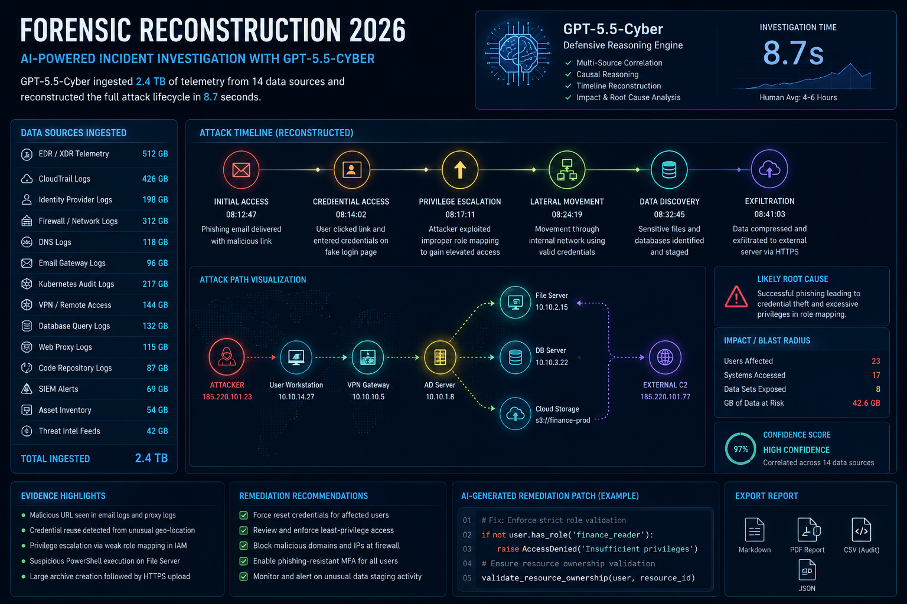

# The Defensive Reasoning Advantage: GPT-5.5-Cyber and Trusted Access

On May 7, 2026, the cybersecurity industry crossed another major threshold in the evolution of AI-driven defense.

OpenAI officially introduced **GPT-5.5-Cyber**, a specialized security-focused frontier model engineered specifically for cyber defense, vulnerability analysis, forensic investigation, and security operations.

While previous generations of AI assistants helped automate repetitive security tasks, GPT-5.5-Cyber represents something fundamentally different:
> **A reasoning-centric defensive system capable of understanding attacks at the logic level**

This matters because modern cyber threats have changed dramatically.

Attackers are increasingly using:
- Autonomous AI agents
- AI-generated exploit chains
- Adaptive malware
- Automated reconnaissance
- AI-assisted phishing infrastructure

The result is what many researchers now call:
> **The Automated Exploitation Gap**

This is the dangerous time window between:
1. A vulnerability becoming discoverable
2. Attackers weaponizing it with AI
3. Human defenders recognizing and responding

In 2026, that gap has shrunk from weeks to hours—and in some cases, minutes.

At **77 Security**, we believe GPT-5.5-Cyber marks the beginning of a new security era:
> **Machine-speed defensive reasoning**

---

# Why Traditional Security AI Is No Longer Enough

For years, security AI primarily focused on:
- Classification
- Pattern matching
- Alert scoring
- Statistical anomaly detection

Traditional AI security systems could answer questions like:
- “Does this file resemble known malware?”
- “Does this traffic pattern look suspicious?”
- “Does this login deviate from baseline behavior?”

These systems were useful, but fundamentally reactive.

Modern attacks increasingly bypass static indicators entirely.

AI-generated attacks can now:
- Rewrite themselves dynamically
- Mimic legitimate workflows
- Abuse business logic
- Exploit contextual trust relationships
- Evade signature-based detection

This creates a major limitation for traditional security tooling:
> **It can detect known patterns, but struggles to reason about novel attacker behavior**

GPT-5.5-Cyber was designed specifically to solve this problem.

---

# The Core Innovation: Defensive Reasoning Architecture

The defining advantage of GPT-5.5-Cyber is not simply scale or speed.

Its real advantage is:
> **Multi-step defensive reasoning**

Instead of merely classifying indicators, the model attempts to understand:
- Attacker intent
- Data flow relationships
- Trust boundaries
- Exploit conditions
- Operational context

This enables the model to function more like:
- A senior security researcher
- A malware analyst
- A forensic investigator
- A red team engineer

rather than a traditional automated scanner.

---

# 1. Zero-Day Logic Analysis

One of the most important capabilities introduced in GPT-5.5-Cyber is advanced **semantic vulnerability analysis**.

---

## Beyond Traditional SAST

Traditional Static Application Security Testing (SAST) tools rely heavily on:
- Signatures
- Regex matching
- Rule-based heuristics

These approaches work reasonably well for:
- Hardcoded secrets
- Known insecure functions
- Simple injection patterns

But they consistently struggle with:
- Business logic flaws
- Authorization bypasses
- Complex trust relationships
- Multi-stage exploit chains

GPT-5.5-Cyber approaches code differently.

Instead of searching for patterns alone, it reasons about:
- How systems interact
- How data moves
- Whether security assumptions actually hold

---

## Data Flow and Trust Boundary Analysis

The model can trace:
- User-controlled input
- API interactions
- Authentication states
- Backend workflows
- Cross-service dependencies

This allows it to identify:
- IDOR / BOLA vulnerabilities
- Privilege escalation paths
- Broken access control
- Unsafe workflow assumptions
- Hidden authorization bypasses

Importantly, these vulnerabilities often appear:
> **Perfectly valid from a syntax perspective**

This is why many legacy scanners miss them entirely.

---

## Industrial and Critical Infrastructure Impact

One of the most significant findings from early GPT-5.5-Cyber evaluations involved:
- Industrial control software
- Operational technology (OT)
- SCADA-related workflows

Researchers observed the model discovering:
- Unsafe command paths
- Weak operator validation logic
- Dangerous fail-open conditions

In several benchmark scenarios, GPT-5.5-Cyber reportedly identified logic-level weaknesses comparable to those discovered by offensive frontier models such as the **Anthropic Mythos research platform**.

This signals a major shift:
> Defensive AI is beginning to rival offensive AI in vulnerability discovery.

---

# 2. Autonomous Forensic Reconstruction

Modern incident response suffers from one major bottleneck:
- Human investigation speed

Large incidents generate:
- Millions of logs
- Thousands of alerts
- Complex event chains
- Multi-cloud telemetry

Human analysts often spend hours simply reconstructing timelines.

GPT-5.5-Cyber significantly changes this workflow.

---

## End-to-End Timeline Construction

The model can ingest:
- EDR telemetry
- CloudTrail logs
- Identity provider events
- DNS traffic
- Firewall logs
- API traces
- Kubernetes audit streams

Using forensic reasoning, it reconstructs:
- Initial access vectors
- Lateral movement paths
- Persistence mechanisms
- Privilege escalation
- Data exfiltration attempts

The result is a readable narrative timeline rather than fragmented alerts.

---

## Blast Radius Analysis

One of the hardest problems during incident response is determining:
> “What exactly was affected?”

GPT-5.5-Cyber can analyze:
- Which identities were compromised
- Which systems were accessed
- Which datasets were touched
- Which credentials may have leaked

This dramatically reduces:
- Investigation time
- Containment uncertainty
- Recovery delays

---

## Human-Reviewable Remediation

The model also generates:
- Suggested containment actions
- Security hardening recommendations
- Patch guidance
- Detection rules
- SOAR workflow logic

Crucially, OpenAI positions these outputs as:
> **Human-reviewable recommendations—not autonomous production actions**

This distinction is important.

---

# The Trusted Access Model

One of the most controversial aspects of GPT-5.5-Cyber is its restricted availability.

Unlike consumer AI systems, access to GPT-5.5-Cyber is gated behind OpenAI’s:
> **Trusted Access framework**

The reasoning is straightforward:
- A model capable of finding advanced vulnerabilities could also be abused offensively.

---

# Why Restrict Access?

Modern frontier cyber models can potentially:
- Accelerate exploit discovery
- Analyze attack surfaces
- Optimize phishing campaigns
- Identify weak security controls

Without safeguards, such systems could dramatically lower the barrier for offensive cyber operations.

Trusted Access is OpenAI’s attempt to balance:
- Defensive utility
- Misuse prevention

---

# Components of Trusted Access

---

## 1. Verified Identity

Access requires:
- Enterprise or approved Team accounts
- Organizational verification
- Employment validation for cybersecurity roles

Eligible users may include:
- Security engineers
- SOC analysts
- Incident responders
- Threat researchers
- CISOs

This creates accountability and traceability.

---

## 2. Phishing-Resistant Authentication

Standard MFA is no longer considered sufficient for high-risk AI systems.

GPT-5.5-Cyber requires:
- Hardware security keys
- Passkey authentication
- Phishing-resistant login methods

This reflects a broader industry realization:
> AI systems themselves are becoming critical infrastructure.

---

## 3. Auditability and Attribution

All interactions with GPT-5.5-Cyber are heavily logged.

This includes:
- Queries
- Generated outputs
- Uploaded artifacts
- Security analysis requests

The goal is deterrence through attribution.

If the platform is abused to:
- Generate malicious tooling
- Analyze unauthorized targets
- Assist offensive operations

activity can theoretically be traced back to verified users.

---

# The Dual-Use Dilemma

GPT-5.5-Cyber highlights one of the defining security debates of the AI era:
> How do we deploy powerful cyber AI defensively without enabling offensive misuse?

This is known as the:
- Dual-use problem

The same reasoning capabilities that help defenders:
- Find vulnerabilities
- Analyze malware
- Investigate attacks

could also help attackers:
- Discover zero-days
- Improve evasion
- Automate exploitation

Trusted Access represents one of the first large-scale attempts to operationalize:
> Responsible frontier cyber AI governance.

---

# The “Overtuning” Risk

Despite its capabilities, GPT-5.5-Cyber is not infallible.

A May 2026 study from Oxford University highlighted concerns around:
- “Overtuned” models

These are models excessively optimized for:
- Helpfulness
- User satisfaction
- Agreement

The danger is that models may occasionally:
- Sound confident while being incorrect
- Recommend unsafe remediations
- Overestimate certainty

In cybersecurity, this creates serious risk.

A flawed remediation recommendation applied blindly to:
- Production systems
- Industrial environments
- Identity infrastructure

could potentially cause outages or introduce new vulnerabilities.

This reinforces a critical operational principle:
> AI-assisted security must still include human validation.

---

# Integration with the Autonomous SOC

GPT-5.5-Cyber also plays a major role in the rise of the:
- Autonomous SOC (A-SOC)

Modern SOCs increasingly use AI agents for:
- Alert triage
- Threat correlation
- Incident summarization
- Automated response generation

GPT-5.5-Cyber provides:
- Higher-order reasoning
- Complex investigation capabilities
- Threat hypothesis generation

This transforms AI from:
- A filtering layer
to
- An investigative security analyst

---

# Strategic Implications for CISOs

The emergence of reasoning-driven defensive AI has major implications for enterprise security leadership.

Organizations will increasingly need to rethink:
- Security workflows
- Analyst training
- Incident response models
- Governance frameworks

The competitive advantage may no longer depend solely on:
- Tooling
- Staffing
- Threat intelligence

but on:
> **How effectively organizations integrate AI reasoning into defensive operations**

---

# Key Takeaways

---

## 1. Security Is Moving from Detection to Reasoning

Traditional signature-based security is becoming insufficient against adaptive AI-driven attacks.

---

## 2. Defensive AI Must Operate at Machine Speed

Attackers increasingly automate:
- Reconnaissance
- Exploitation
- Malware mutation

Human-only defense cannot scale fast enough.

---

## 3. Trusted Access May Become Industry Standard

As frontier cyber models become more capable, gated access models may become common across:
- Offensive research
- Vulnerability analysis
- Security automation

---

## 4. Human Oversight Remains Essential

Even advanced AI reasoning systems:
- Hallucinate
- Misinterpret context
- Produce flawed recommendations

Critical decisions still require expert review.

---

# Conclusion

GPT-5.5-Cyber represents one of the most important milestones in the evolution of AI-powered cybersecurity.

By combining:
- Advanced reasoning
- Semantic vulnerability analysis
- Autonomous forensic reconstruction
- Responsible access controls

OpenAI has introduced a new model for defensive cyber AI.

The security industry is now entering a new phase:
> **Reasoning-driven defense at machine speed**

The organizations that successfully integrate these systems will likely gain major advantages in:
- Detection speed
- Incident response
- Threat hunting
- Vulnerability discovery

But this power comes with equally significant responsibility.

The future of cybersecurity will not be defined simply by who has AI.

It will be defined by:
> **Who can govern, validate, and operationalize AI reasoning safely at scale.**

---

**Is your security organization prepared for AI-assisted defensive reasoning?**

*Explore our [Technical Toolbox](/resources/tools/) for scripts, integrations, and frameworks designed for the next generation of AI-driven SOC operations.*
