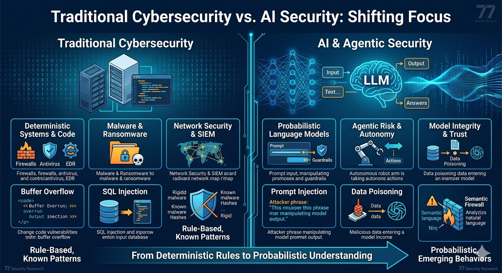

import { Card, CardGrid } from '@astrojs/starlight/components';
import RecentArticles from '../../components/RecentArticles.astro';

<section id="latest-news">
## Latest Intelligence
Our most recent research on LLM vulnerabilities, autonomous agents, and AI-driven cyber warfare.
<RecentArticles />
</section>

---

## Why AI Security?

The rapid adoption of Large Language Models (LLMs) and Autonomous Agents has created a new attack surface that traditional cybersecurity was never built to handle. Unlike classic software, AI systems are **probabilistic**, not deterministic.

### The New Frontier of Risk
In an AI-driven world, a "malicious" input might look like a perfectly normal sentence. Our research focuses on three primary pillars:

* **Semantic Vulnerabilities:** Attacks like *Prompt Injection* turning a trusted assistant into a "confused deputy."
* **Data Integrity:** Preventing *Data Poisoning* and backdoors in training sets.
* **Agentic Risk:** Securing autonomous users with high-level API privileges.

---

## Our Methodology
<CardGrid stagger>
  <Card title="Adversarial Testing" icon="magnifier">
    We simulate real-world attacks to identify where LLM guardrails fail under pressure.
  </Card>
  <Card title="Security for AI" icon="shieldCheck">
    Focusing on the infrastructure: Securing the data pipeline and the model weights.
  </Card>
  <Card title="AI for Security" icon="rocket">
    Leveraging machine learning to automate threat detection and response at scale.
  </Card>
  <Card title="Policy & Ethics" icon="document">
    Analyzing the EU AI Act and NIST frameworks to ensure compliance and safety.
  </Card>
</CardGrid>

:::tip[Join the Research]
Are you a security researcher? Check out our [Glossary](/resources/glossary/) to get up to speed on the latest 2026 threat terminology.
:::
